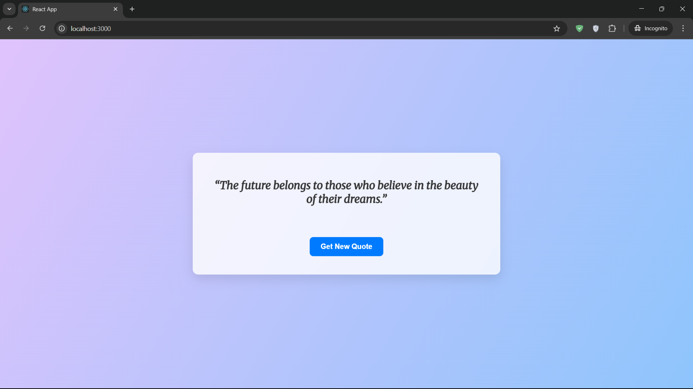
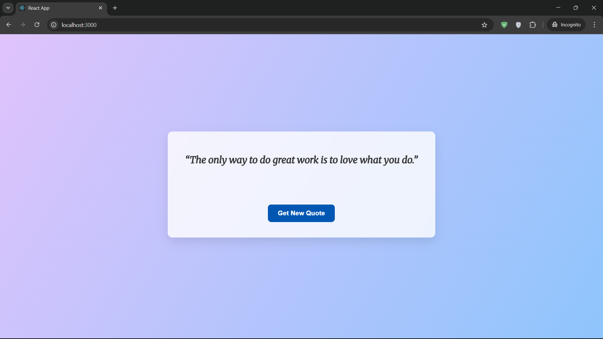

# Quote of the Day Application

A beautiful and responsive full-stack web application that displays random inspirational quotes. This project demonstrates a modern frontend built with React communicating with a robust backend REST API powered by Java and Spring Boot.

## Screenshots

Here's a look at the application's interface.

|  |  |  |

---

## Features

* **Dynamic Quotes:** Fetches a new random quote from the backend API with a single button click.
* **Modern UI:** A clean, stylish interface featuring a "frosted glass" card effect over a smooth gradient background.
* **Responsive Design:** The layout is fully responsive and looks great on all devices, from mobile phones to desktops.
* **Loading State:** Provides clear user feedback while a new quote is being fetched from the server.
* **Hover Effects:** Subtle animations on the quote card and button enhance the user experience.

---

## Tech Stack

This project is built with a classic full-stack combination:

* **Backend:**
    * [**Java**](https://www.java.com/)
    * [**Spring Boot**](https://spring.io/projects/spring-boot) (for the REST API)
    * [**Maven**](https://maven.apache.org/) (for dependency management)
* **Frontend:**
    * [**React.js**](https://reactjs.org/)
    * **Modern CSS** (Flexbox, Gradients, Transitions)
    * [**Node.js & npm**](https://nodejs.org/)

---

## How to Run Locally

To get this project running on your local machine, follow these steps.

### Prerequisites

Make sure you have the following installed:

* Java (Version 11 or higher)
* Apache Maven
* Node.js and npm

### 1. Backend Setup (`quote-api`)

First, get the backend server running.

```bash
# 1. Clone the backend repository
git clone <your-backend-repo-url>

# 2. Navigate into the project directory
cd quote-api

# 3. Run the application
# On Windows:
.\mvnw.cmd spring-boot:run

# On macOS/Linux:
./mvnw spring-boot:run
